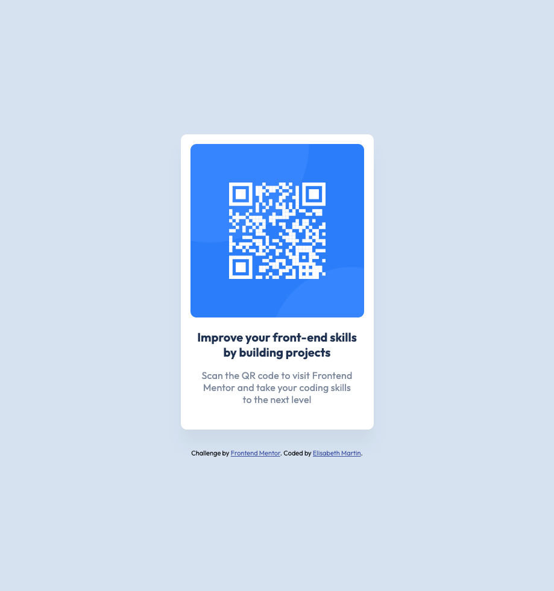

# Frontend Mentor - QR code component solution

This is a solution to the [QR code component challenge on Frontend Mentor](https://www.frontendmentor.io/challenges/qr-code-component-iux_sIO_H).

## Table of contents

- [Overview](#overview)
  - [Screenshot](#screenshot)
  - [Links](#links)
- [My process](#my-process)
  - [Built with](#built-with)
- [Author](#author)

## Overview

### Screenshot

### Links

- Solution URL: [https://github.com/Blondeli/qr-code-component-main](https://github.com/Blondeli/qr-code-component-main)
- Live Site URL: [https://blondeli.github.io/qr-code-component-main/](https://blondeli.github.io/qr-code-component-main/)

## My process

### Built with

- Semantic HTML5 markup
- CSS custom properties
- Flexbox

## Author

- Frontend Mentor - [@Blondeli](https://www.frontendmentor.io/profile/blondeli)
- LinkedIn - [Elisabeth Martin](https://www.linkedin.com/in/elisabeth-martin-873773199/)
